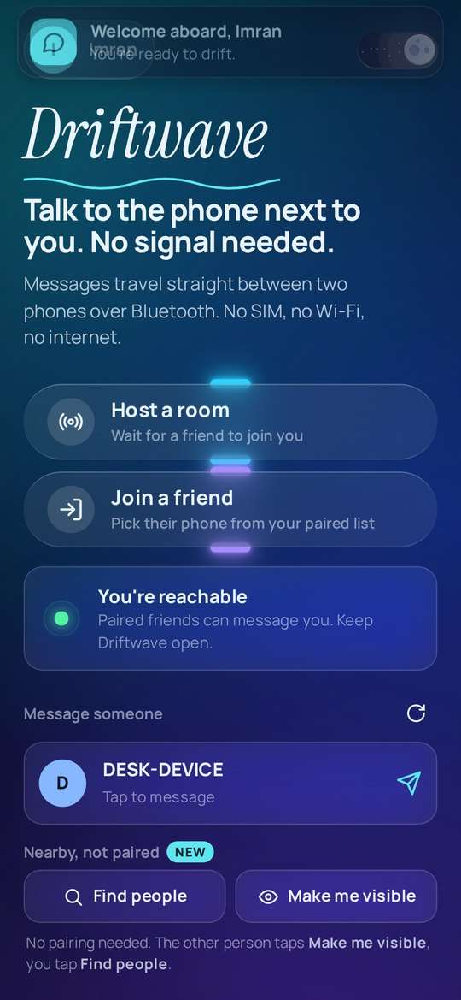
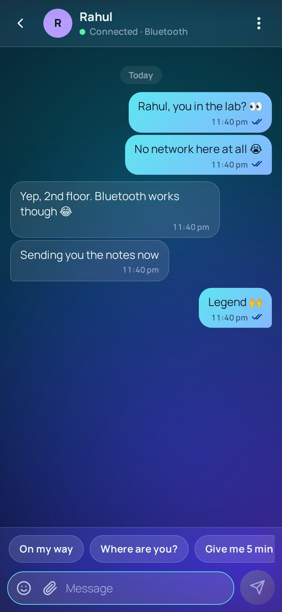
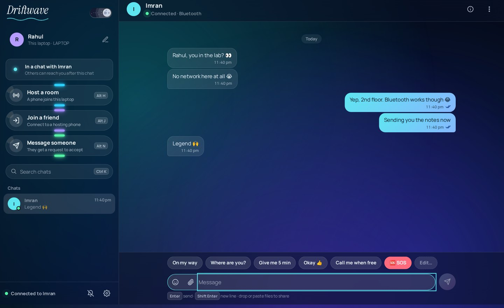
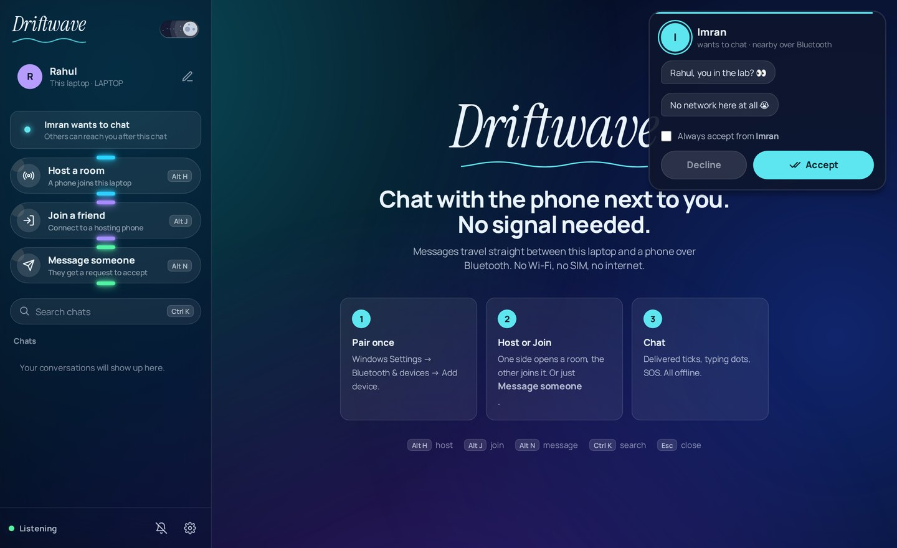

  

<h1 align="center">Driftwave</h1>

<b>Chat with the phone or laptop next to you. No internet, no SIM, no Wi-Fi.</b> 
Messages, photos and files travel straight between devices over Bluetooth.

  <a href="https://github.com/imran2007-A/Driftwave/releases/latest/download/Driftwave.apk"><b>⬇ Download for Android (.apk)</b></a>
  &nbsp;·&nbsp;
  <a href="https://github.com/imran2007-A/Driftwave/releases/latest/download/Driftwave-Windows.zip"><b>⬇ Download for Windows (.zip)</b></a>

  
  &nbsp;
  

  

---

## What it does

- **Offline chat over Bluetooth**: phone ↔ phone, phone ↔ laptop, laptop ↔ laptop. About 10 m range.
- **Three ways to connect**
  - **Host a room / Join a friend**: one device opens a room, the other joins it.
  - **Message someone**: tap a paired device and type. They get a request card with your message, then **Accept** or **Decline**, like AirDrop.
  - **Nearby, not paired**: find people who were never paired. They tap *Make me visible*, you tap *Find people*.
- **Send files**: photos, PDFs, Word, PowerPoint, Excel, TXT and ZIP up to 10 MB, with a live progress bar and cancel.
- Delivered ticks, typing dots, quick replies, emoji, an **SOS** button, sounds and vibration, and a light/dark theme.
- Chats are saved on your device. Nothing ever touches a server.

## Install

### Android phone
1. Download **[Driftwave.apk](https://github.com/imran2007-A/Driftwave/releases/latest/download/Driftwave.apk)** on your phone.
2. Open it and tap **Install**. If Android says *unknown app*, tap **Settings → Allow from this source**, then install.
3. Open **Driftwave v2**, pick your name, and allow **Nearby devices** (plus **Location** if you use *Find people*).

### Windows laptop / PC (Windows 10 or 11 with Bluetooth)
Nothing else to install. Python is already inside the zip.
1. Download **[Driftwave-Windows.zip](https://github.com/imran2007-A/Driftwave/releases/latest/download/Driftwave-Windows.zip)**.
2. Right-click it, choose **Extract All**, and open the extracted folder. Don't run it from inside the zip.
3. Open **Driftwave for Windows** and double-click **Start Driftwave.bat**.
   If Windows shows *"Windows protected your PC"*, click **More info → Run anyway**.
4. Optional: double-click **Create desktop shortcut.bat** to get a Driftwave icon on your desktop.

## How to connect

| You want to… | Do this |
|---|---|
| Chat with a device you've **paired** before | Tap it under **Message someone**. They tap **Accept**. |
| Chat the classic way | One side taps **Host a room**. The other taps **Join a friend** and picks it. |
| Chat with someone you've **never paired** | They tap **Make me visible**. You tap **Find people**, then their name. |

- Tick **"Always accept from …"** on the request card to skip it next time.
- Driftwave has to be **open** on the other device to receive a message.
- To pair once (optional): Phone → *Settings → Bluetooth*; Windows → *Settings → Bluetooth & devices → Add device*.

## Where received files go
- **Phone:** `Downloads/Driftwave`
- **Laptop:** `Downloads\Driftwave Received`

## Troubleshooting
- **"Couldn't reach …"**: make sure Driftwave is open on the other device, it's close by, and it isn't already in another chat.
- **Find people shows nobody**: the other person must tap **Make me visible** first. On phones, keep **Location** switched on while searching.
- **Laptop can't be found / "Not reachable"**: start the chat from the laptop instead, or pair the two devices once in Bluetooth settings.
- **Windows asks to pair**: that's Windows being cautious with a device it doesn't know. Accept it once.

## Built with
- **Android:** MIT App Inventor, with an HTML/JS interface and a custom Java extension for files and pairing-free Bluetooth.
- **Windows:** Python (standard library only) with the Windows Bluetooth API, and the same interface in an app window.

---

Made by <b>Imran</b>

